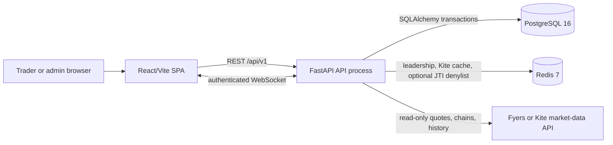
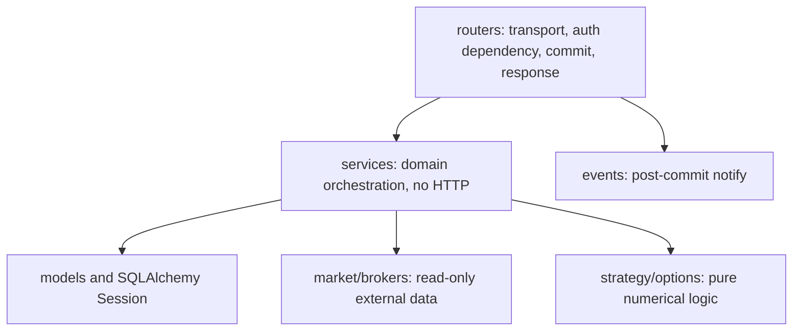
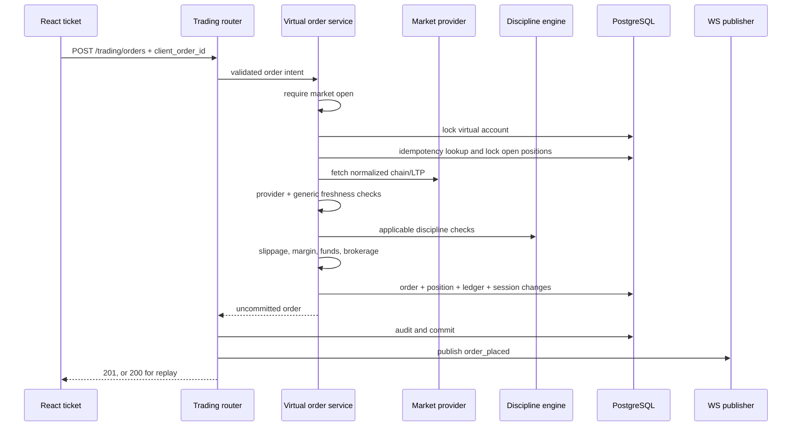

# Architecture

**Verified:** 2026-07-30

## 1. System context



The browser never talks directly to PostgreSQL or a broker. The selected market
provider is a module singleton in each API process. Paper execution reads a
normalized chain, then writes only local application tables.

## 2. Repository structure

```text
StrikeFluency/
├── backend/
│   ├── app/
│   │   ├── main.py             FastAPI construction and lifespan
│   │   ├── config.py           typed environment settings
│   │   ├── database.py         engine, session factory, declarative base
│   │   ├── dependencies.py     HTTP authentication/authorization
│   │   ├── core/               safety, auth, constants, plans, errors, time
│   │   ├── models/             SQLAlchemy mappings and append-only guards
│   │   ├── schemas/            Pydantic request/response contracts
│   │   ├── routers/            HTTP and WebSocket adapters
│   │   ├── services/           transactional business operations
│   │   ├── market/             provider implementations, freshness, WS, jobs
│   │   ├── market_data/        compatibility market-data service
│   │   ├── brokers/            read-only broker adapters and connections
│   │   ├── strategy/           pure pricing/payoff/domain mathematics
│   │   ├── options/            pure option-chain analytics mathematics
│   │   └── events/             committed-state notification vocabulary
│   ├── migrations/             Alembic history (20 revisions, one head)
│   └── tests/                  unit and PostgreSQL integration tests
├── frontend/
│   ├── src/api/                Axios domain clients
│   ├── src/components/         shared and domain UI
│   ├── src/features/           feature-owned UI/configuration
│   ├── src/hooks/              auth, market, trading, theme helpers
│   ├── src/pages/              routed screens
│   ├── src/store/              Zustand stores
│   ├── src/styles/             global tokens and theme CSS
│   └── src/utils/              formatting, errors, validators, P&L helpers
├── Docs/                       this canonical set and ADRs
├── scripts/setup-backend.ps1   reproducible Windows backend bootstrap
├── docker-compose.yml          Redis and pgAdmin for local development
└── .github/workflows/ci.yml    backend and frontend CI
```

## 3. Backend layering



Routers validate transport contracts, obtain `CurrentUser`/`CurrentAdmin`, call
services, own the normal request commit, refresh ORM rows when necessary, and
publish after commit. Services are synchronous module functions or small domain
objects and raise exceptions from `app/core/exceptions.py`. Exception handlers
map those errors to HTTP responses.

Known service-owned transaction exceptions are intentional:

- broker connection/token helpers use short-lived independent sessions;
- token rotation and OAuth commit around single-use session state;
- `pending_order_service.scan_and_fill()` commits each order independently;
- audit `record_now()` uses a separate session for events whose caller will
  roll back, such as a rejected order or failed login.

## 4. Startup and shutdown

Importing `app.main` performs configuration parsing, production validation,
router registration, the route-security audit, and the paper-mode assertion.
Any failure occurs before the server binds.

FastAPI lifespan startup then:

1. reasserts the paper-only configuration;
2. hydrates only the selected broker token;
3. starts the market scheduler and captures the process event loop for
   WebSocket pushes;
4. starts daily refresh-token cleanup.

Shutdown stops both schedulers, releases leadership, closes/resets the selected
market provider and adapter cache, and stops auth maintenance.

## 5. Major runtime flows

### 5.1 MARKET entry



The account row is the user-level serialization point. An idempotent replay is
not repriced and emits no duplicate event.

### 5.2 Resting LIMIT entry

Placement validates the quote and discipline state, reserves margin in the
ledger, and writes `pending_orders`; it does not create a virtual position. A
leader-only five-second sweep checks triggers. On trigger it releases the
reservation and re-enters the MARKET service so freshness, discipline, funds,
slippage, brokerage, idempotency, and downstream journal/analytics behavior are
shared. Each scanned order commits separately.

### 5.3 Close and automatic exit

Close paths lock in this order: account, order, position, session. They obtain
an exit LTP, calculate side-aware slippage, compute gross and net P&L, charge
exit brokerage, release margin, settle P&L, update cooldown/discipline, and
create the journal record. The router or scheduler commits before notifying.

The auto-exit priority for a same-tick gap is stop-loss, then target, then the
explicit exit limit. The explicit limit applies to the whole position and is
bounded so simulated slippage cannot make its fill worse than the saved limit.

### 5.4 Authentication refresh

The refresh cookie contains a single-use JWT whose SHA-256 hash is stored in a
family chain. The service claims the record with a row lock, marks it replaced,
creates a successor that preserves the family's absolute expiry, commits, and
returns a new cookie plus access JWT. Reuse older than the ten-second browser
race tolerance revokes the family and records a security event.

The frontend holds access tokens in a module variable. Its Axios interceptor
uses one shared refresh promise, retries a failed request once, and clears auth
if refresh fails. Initial session restoration is also module-deduplicated to
survive React StrictMode's doubled effects.

### 5.5 WebSocket data and notifications

`/api/v1/market/ws?token=...` authenticates before `accept()`. The process-local
connection manager stores global and per-user socket sets and replays the latest
steady-state frame by `(type, instrument)` on connect.

Market frames carry data. `trading_update` carries only `reason` and timestamp;
the frontend increments an event sequence and domain pages reload REST data.
This avoids maintaining a second position representation in WebSocket payloads.

## 6. State and consistency boundaries

### Funds

`virtual_accounts.balance == SUM(virtual_fund_ledger.amount)` for each account.
The initial credit is a ledger row, so `initial_balance` is not added to the
sum. `initial_balance` is a discipline-loss denominator and may change when
sandbox capital unlocks.

### Orders and positions

`virtual_orders` is both order and fill record while partial fills do not exist.
A unique order-to-position relationship enforces one whole-position lifecycle.
Pending entries are separate because they have not filled and own only a margin
reservation.

### Tenancy

Domain rows carry tenant and/or user identifiers. Normal user services scope by
the authenticated user. Admin reads derive tenant scope from the admin row;
query parameters can filter only inside that scope.

### Transactions and events

Database state is authoritative. In-transaction audit records roll back with
successful operations; rejected/failed events use independent audit sessions.
WebSocket publication is best-effort and cannot fail the committed operation.

## 7. Market-data architecture

`get_market_provider()` selects one process-local provider:

| Provider | Behavior |
|---|---|
| mock | Generates realistic-looking development/test chains; accepted for execution outside production. |
| Fyers | REST structural data with caches and optional socket LTP overlay; missing/invalid credentials fall back to mock. |
| Kite | Redis-backed feed and REST reads; deliberately returns unavailable/stale state rather than mock data. |

Providers normalize to a canonical chain. `options_service` enriches that chain
without persistence. Broker adapters expose read methods only and are checked
against the paper-trading policy.

Freshness has three contracts:

- opening an entry raises when the chain is not orderable;
- a scheduler trigger returns false and waits for another tick;
- a manual/EOD/expiry close is not freshness-gated, but is still market-hours
  gated and may use the bounded position LTP fallback.

## 8. Scheduler architecture

Each API process owns broadcast jobs because it owns its own WebSocket clients.
Only a Redis lease holder runs database-mutating jobs. The lease TTL defaults to
30 seconds and renews at roughly one third of the TTL.

| Job | Schedule | Mutates DB | Leader-gated |
|---|---:|---:|---:|
| status + option-chain broadcast | 1 second | No | No |
| option metrics + analytics broadcast | 15 seconds | No | No |
| strategy mark-to-market | 15 seconds | Yes | Yes |
| SL/target/exit-limit scan | 5 seconds | Yes | Yes |
| pending LIMIT fill scan | 5 seconds | Yes | Yes |
| strategy expiry settlement | 15:29 | Yes | Yes |
| intraday square-off | 15:29 | Yes | Yes |
| portfolio/P&L snapshots | 15:35 | Yes | Yes |
| stale DAY-limit cleanup | 08:30 | Yes | Yes |
| Kite catalog sync | 08:30 | Yes | Yes |
| refresh-token cleanup | 03:15 UTC | Yes | Separate scheduler |

## 9. Deployment topology implications

A single API process is the simplest fully coherent topology. Multiple API
workers are safe for database-mutating scheduler jobs only when Redis is
available, because leadership prevents duplicates. Market broadcasts remain
correct per worker. Targeted `trading_update` delivery is process-local, so a
router on worker A cannot notify a socket connected to worker B. Until a shared
event bus exists, use one worker or accept REST refresh/polling as the recovery
path for cross-worker events.

The repository contains no production ingress, process manager, container
image, or infrastructure definition. See [Operations and deployment](OPERATIONS.md)
for the requirements a deployment platform must supply.
