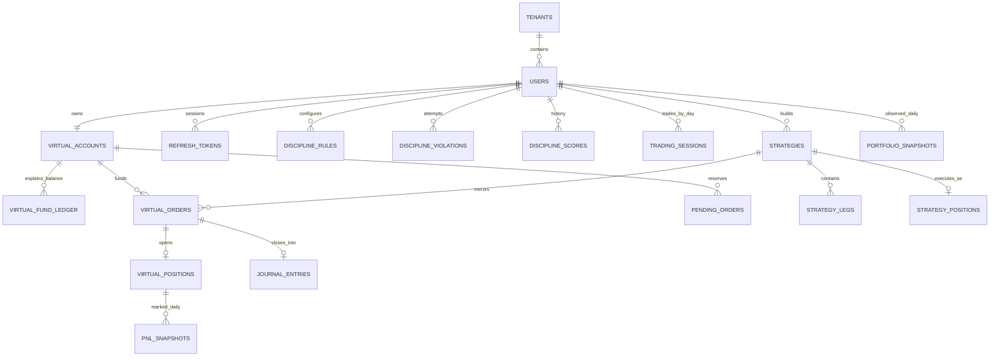

# Data model and migrations

**Verified:** 2026-07-30

**Database:** PostgreSQL 16

**ORM inventory:** 27 tables

## 1. Principles

- SQLAlchemy models are the runtime mapping; Alembic revisions are the deployed
  schema history. Both must change together.
- UUIDs identify tenant/user/domain records. Money uses fixed-precision Numeric
  columns and `Decimal` in services.
- Most domain rows denormalize `user_id` and `tenant_id` for direct scoping and
  auditability.
- `virtual_fund_ledger` and `audit_logs` prohibit UPDATE. Derived daily snapshot
  tables intentionally upsert on a same-day rerun.
- `virtual_orders` is the execution record until partial fills exist.
- JSONB is used where keys evolve independently of the relational lifecycle.

## 2. Relationship overview



## 3. Identity, auth, and preferences

| Table | Purpose and important fields/constraints |
|---|---|
| `tenants` | Tenant identity: unique `tenant_code`, name, active flag, creation time. |
| `users` | Global unique email, password hash, tenant FK, full name, role, `plan`, active flag, `token_version`. `plan` is constrained to free/pro. |
| `refresh_tokens` | Hashed refresh JWT, user/tenant, family/parent chain, persistent/ephemeral policy, absolute expiry, rotation/revocation timestamps and reason, device metadata. Family and active-terminal indexes support session management. |
| `oauth_transactions` | Short-lived server transaction: provider, state, PKCE verifier, remember-me, expiry, consumed timestamp. |
| `oauth_identities` | Provider subject linked to one user, provider email, link method/time; unique provider identity semantics. |
| `link_challenges` | Expiring password-confirmation challenge for linking a provider to an existing user. |
| `security_notifications` | User-facing security event/message records. |
| `user_settings` | One row per user; JSONB preference overrides merged with typed defaults; tenant index. |
| `broker_connections` | Broker name, encrypted access/refresh tokens, JSON metadata, status/timestamps. Current active credential helpers use global rows with nullable `user_id`. |

## 4. Accounts, orders, positions, and ledger

| Table | Purpose and important fields/constraints |
|---|---|
| `virtual_accounts` | One account per user: live balance, discipline denominator `initial_balance`, tier, streak, score, mode flags. Balance must be written only through ledger service. |
| `virtual_fund_ledger` | Signed balance deltas with global identity sequence, before/after balance, transaction/reference types, description. Indexed by account sequence, user time, tenant, and reference. UPDATE prohibited by ORM and PostgreSQL trigger. |
| `virtual_orders` | Filled standalone/mirrored order: user/account, idempotency UUID, snapshotted contract, entry/exit/protection prices, exit limit, status/product/trading day, P&L, entry/round-trip brokerage, slippage, setup/compliance/free-play, optional strategy. Unique `(user_id, client_order_id)` for non-null client IDs. |
| `virtual_positions` | Whole standalone position and mark: unique order FK, account, contract, quantity, entry/current price, unrealized P&L, blocked margin, open/close timestamps. One order cannot have multiple partial positions. |
| `pending_orders` | Unfilled DAY LIMIT intent and reservation: client ID, contract/product, limit and placed LTP, protection/setup, status, blocked margin, trading day, optional filled order/price/time, terminal reason/times. User/status/day indexes. |
| `trading_sessions` | One user/date row: trade count, realized P&L, cooldown flag/until, last SL timestamp. |

### Balance reconciliation

For every account:

```sql
SELECT va.id,
       va.balance,
       COALESCE(SUM(vfl.amount), 0) AS ledger_total
FROM virtual_accounts va
LEFT JOIN virtual_fund_ledger vfl ON vfl.account_id = va.id
GROUP BY va.id
HAVING va.balance <> COALESCE(SUM(vfl.amount), 0);
```

An empty result is healthy. The admin ledger endpoint performs the same logical
check for one in-scope user.

## 5. Discipline and journal

| Table | Purpose and important fields/constraints |
|---|---|
| `discipline_rules` | One user/rule code, JSONB rule value, active state, timestamps. |
| `discipline_violations` | Attempted action JSON, rule code, blocked flag, trading session date, timestamp. |
| `discipline_scores` | One user/score date with score, sample count, violation count, and streak snapshot. |
| `journal_entries` | One per virtual order: copied fill/P&L/fee/setup/exit/compliance data plus user-authored emotion, mistake, thesis, review, and reviewed flag. Unique `order_id`. |

Journal rows deliberately copy historical facts from the order so later display
does not depend entirely on mutable live state. Contract display properties also
join to the owning order.

## 6. Strategies

| Table | Purpose and important fields/constraints |
|---|---|
| `strategies` | User/account draft or executed strategy: underlying, optional template/name, calendar/product/setup, status, notes, calculated premium/profit/loss. |
| `strategy_legs` | Strategy-owned option/future leg with expiry/strike/action/lots/snapshotted lot size, entry/exit, status, realized P&L, timestamps. |
| `strategy_positions` | One execution-level margin/P&L/brokerage record with open/close state. |
| `strategy_builder_configurations` | Versioned `SAVED`/`DRAFT` builder JSONB state with optional name and underlying. |

Mirrored `virtual_orders.strategy_id` rows connect strategy fills to shared
journal/analytics concepts without creating a separate execution table.

## 7. Market reference data and snapshots

| Table | Purpose and important fields/constraints |
|---|---|
| `kite_instruments` | Kite instrument master keyed by instrument token: exchange/segment/symbol/name, expiry, strike, tick/lot, type, normalized underlying, sync time. Search indexes cover symbol, underlying-expiry-type, segment/type, and expiry. |
| `portfolio_snapshots` | Unique user/date account observation: balance, blocked margin, unrealized/realized P&L, equity, position/trade counts, tier, score. Check enforces `equity = balance + margin_blocked + unrealized_pnl`. |
| `pnl_snapshots` | Unique position/date open-position attribution: contract, mark, unrealized P&L, blocked margin, order/position IDs. |

Snapshot services isolate failures per user and use nested transaction/savepoint
behavior so one malformed account does not discard the entire batch. A same-day
rerun updates the derived observation.

## 8. Audit trail

`audit_logs` records a global identity sequence, optional tenant/user, action,
success/failure outcome, optional reference, JSON detail, client IP, user agent,
and time. Nullable ownership is required for failed login attempts against an
unknown email.

UPDATE is prohibited by both ORM and PostgreSQL. DELETE is permitted for user
deletion/test teardown and leaves sequence gaps. `record()` joins a successful
operation's transaction; `record_now()` independently commits failures/rejections
that the caller will roll back.

## 9. Deletion and ownership notes

The model uses relational foreign keys rather than a universal soft-delete
framework. `users.is_active` controls authentication, but many child rows are
durable history. Before adding or changing cascade behavior, test account/user
deletion against ledger and audit requirements.

Integration fixtures maintain explicit teardown order. A new table referencing
`users` or `virtual_accounts` must be added to the conftest schema drift patcher
and `tests/integration/test_order_concurrency.py` committed-user cleanup.

## 10. Migration history

The chain is linear with head `20260802_order_exit_limit`.

| Revision | Change |
|---|---|
| `7f6ed0e8d2c9` | Initial tenant, user, auth, account, order, position, discipline, session, and journal schema. |
| `20260709_1200` | Broker connections. |
| `20260711_auth_hardening` | Token version, refresh families, policies, rotation/revocation metadata. |
| `20260711_oauth_hardening` | OAuth transactions/identities, link challenges, security notifications. |
| `20260713_global_unique_email` | Global email uniqueness. |
| `20260718_strategy_builder` | Strategy, leg, position, and order strategy linkage. |
| `20260720_discipline_mode` | Master mode, capital unlock, and free-play marker. |
| `20260721_user_settings` | JSONB per-user preferences. |
| `1674dd5f928c` | Cleanup of redundant user-email/order-strategy indexes. |
| `20260721_trading_day_product` | Product type, trading-day boundary, related checks/index. |
| `20260724_kite_instruments` | Kite catalog. |
| `20260724_order_idempotency` | User-scoped client order IDs. |
| `20260724_strategy_workspace` | Saved/draft builder configurations. |
| `20260727_pending_orders` | Resting LIMIT entry table and indexes. |
| `20260728_order_entry_brokerage` | Separate entry brokerage with data backfill. |
| `20260729_virtual_fund_ledger` | Ledger, initial reconciliation backfill, indexes, update trigger. |
| `20260730_audit_logs` | Audit table, indexes, update trigger. |
| `20260731_snapshots` | Daily portfolio and per-position P&L snapshots. |
| `20260801_user_plan` | Free/pro plan seam and check. |
| `20260802_order_exit_limit` | Full-position resting exit limit on virtual orders. |

CI applies this entire history to an empty PostgreSQL database before tests. A
migration that works only against an already-patched developer database is not
valid.

## 11. Schema change checklist

1. Change the ORM model and import it from `models/__init__.py`.
2. Generate and hand-review the Alembic revision.
3. Provide safe data backfills before making new columns non-null.
4. Name constraints and indexes consistently.
5. Preserve downgrade behavior where data loss is understood and acceptable.
6. Update integration schema patching and teardown.
7. Add service/router schemas and tenant/user scoping.
8. Use the ledger for every balance implication and audit sensitive actions.
9. Run an empty-database upgrade, backend tests, and migration head check.
10. Update this document and an ADR for a deliberate structural exception.
