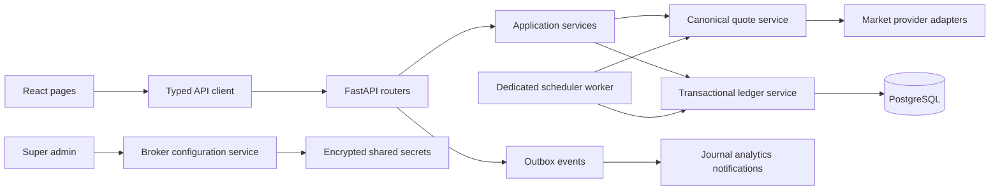

# StrikeFluency `main` Branch — Full Code Review and Improvement Plan

> Audience: Claude Code or another implementation agent working in this repository.
>
> Review date: 2026-07-21 (Asia/Kolkata)
>
> Reviewed branch: GitHub `main`
>
> Reviewed commit: `0723da56bee043292e1a33ee267ffefe663a9fb2`
>
> Review method: full repository inventory, dependency graph analysis, backend/frontend contract tracing, security and concurrency review, backend tests, frontend production build, dependency audit, and Alembic migration graph inspection.

## 1. Executive verdict

The repository has a solid foundation, but `main` is not production-ready yet. The largest risk is not code style; it is correctness across module boundaries. The backend and frontend have evolved independently in several places, so important pages compile successfully while displaying empty, zero, or stale values at runtime.

The release should be blocked until the P0 findings in this report are fixed. The most important problems are:

1. Any authenticated user can replace or revoke the application-wide Fyers credentials/token, and the public Fyers callback is not tied to an authenticated setup transaction.
2. The single-leg order engine ignores the requested expiry and fills a missing option strike with the index spot price. That can produce economically impossible virtual trades.
3. Order placement, closing, strategy execution, and scheduled auto-exit do not lock the affected database rows. Concurrent requests or multiple scheduler workers can deduct/release money or close a position more than once.
4. The Trading Desk option-chain payload is incompatible at two levels: the REST wrapper is stored incorrectly, and the table expects `call`/`put` fields while the backend returns `ce`/`pe`.
5. Journal, analytics, dashboard, and position views use response fields that do not exist in backend schemas.
6. The automated test setup is not reproducible from a clean clone, two unit tests currently fail, integration tests were skipped, there is no frontend test suite, and there is no CI workflow.

Recommended approach: stabilize the API contracts first, then correct execution integrity and concurrency, then improve operations, maintainability, and UX. Do not add more product modules until Phases 0–2 in this report are complete.

## 2. Review evidence and baseline

### 2.1 Repository inventory

- 240 analyzed files
- Approximately 100,762 words
- 2,495 knowledge-graph nodes
- 4,889 relationships
- 199 detected code/document communities
- Most connected domain nodes: `User`, `Strategy`, `Leg`, `OptionContract`, `VirtualAccount`, and `DisciplineEngine`

This graph confirms that market-provider behavior, authentication, `VirtualAccount`, and instrument specifications are cross-cutting dependencies. A bug in any of them affects many modules.

### 2.2 Backend verification

Running `pytest` directly from a clean main worktree fails during collection because `DATABASE_URL` and `SECRET_KEY` are mandatory at import time. With safe test-only values supplied:

```text
206 passed
14 skipped
2 failed
```

Failing tests:

- `tests/unit/test_chain.py::test_price_strategy_sets_entry_and_reports_ok`
- `tests/unit/test_chain.py::test_mock_source_flagged_degraded`

Cause:

- The fixture hardcodes `2026-07-21T10:00:00`, so it becomes stale as wall-clock time moves forward.
- `PricingReport.problems` uses `elif`, so a quote that is both stale and degraded only reports `stale quote` and masks `degraded/mock quote`.

The 14 skipped tests depend on PostgreSQL. Therefore, database-backed order, journal, strategy, and auth behavior was not proven by this run.

### 2.3 Frontend verification

`npm ci` completed, then `npm run build` succeeded:

```text
JavaScript: 887.73 kB minified / 242.82 kB gzip
CSS:         34.27 kB minified /   7.92 kB gzip
```

Vite warns that the JavaScript chunk is larger than 500 kB. The lockfile audit reports:

- 1 high-severity advisory affecting Vite on Windows path handling
- 1 moderate advisory through esbuild/Vite dev-server behavior
- Recharts 2.x is deprecated and no longer active; migration to Recharts 3 should be planned

Do not use `npm audit fix --force` blindly. Upgrade Vite and Recharts intentionally, run the build, then verify all charts and the dev proxy.

### 2.4 Migration verification

Alembic has one linear head:

```text
7f6ed0e8d2c9
  -> 20260709_1200
  -> 20260711_auth_hardening
  -> 20260711_oauth_hardening
  -> 20260713_global_unique_email
  -> 20260718_strategy_builder
  -> 20260720_discipline_mode (head)
```

The migration graph itself is valid. Migration behavior still needs a clean-database CI test and an upgrade test from the previous release.

## 3. Severity definitions

| Priority | Meaning | Required action |
|---|---|---|
| P0 | Security, ledger, or execution-integrity release blocker | Fix before any production or shared beta deployment |
| P1 | Core feature broken or materially misleading | Fix before normal user testing |
| P2 | Reliability, maintainability, performance, or UX weakness | Schedule immediately after core stabilization |
| P3 | Cleanup or polish | Complete after behavior is protected by tests |

## 4. P0 — release-blocking changes

### P0-1. Protect application-wide Fyers credentials and token

#### Evidence

- `backend/app/routers/broker.py:59-158` exposes read, save, revoke, login, token, and exchange operations to ordinary `CurrentUser` accounts.
- `backend/app/services/fyers_auth_service.py:52-80` writes credentials and provider selection into the server `.env` and mutates global settings.
- `backend/app/brokers/connections.py:131-168` always stores/loads Fyers data using `user_id=None`, so it is application-wide, not user-owned.
- `backend/app/routers/broker.py:100-116` provides a public callback that accepts an authorization code without a server-generated setup state tied to an administrator/session.
- Legacy aliases duplicate the same privileged operations at `backend/app/routers/broker.py:175-210`.

#### Impact

Any registered trader can change or remove the market-data credentials used by every user. A malicious or mistaken user can switch the provider, disrupt the service, inject a different broker token, or make all workers disagree about configuration. The callback can also be used to plant a token because it is not bound to an authenticated setup transaction.

#### Required implementation

Choose and document one ownership model:

1. Recommended for the current product: Fyers is an application-level market-data feed managed only by `super_admin`.
2. Alternative: each user owns an independent broker connection, in which case every token query must use `current_user.id`, and the provider architecture must become user-scoped.

For the recommended application-level model:

- Change credential/token mutation routes to require `CurrentAdmin`, preferably `super_admin` specifically.
- Add a server-side Fyers setup transaction with random state, expiry, initiator user ID, and one-time consumption.
- Validate state in the callback before exchanging the code.
- Remove or permanently disable the legacy mutation aliases.
- Do not write application secrets to `.env` through normal HTTP requests. Store encrypted configuration in a secrets manager or admin configuration table.
- Require an explicit `BROKER_TOKEN_ENC_KEY` in production. Do not silently derive the broker encryption key from the JWT signing secret.
- Add an audit record for credential creation, rotation, revocation, and provider changes.
- Return generic client errors; log sanitized provider details server-side.
- In a multi-worker deployment, publish configuration/token changes through a shared store or restart/reload workers deterministically.

#### Acceptance criteria

- A trader receives `403` for every application-level Fyers credential/token mutation.
- A callback without the correct unconsumed state is rejected and cannot alter the active token.
- Two concurrent callback attempts cannot consume the same transaction.
- No API route writes plaintext secrets to `.env` in production.
- Audit tests prove who changed the connection and when.

### P0-2. Never execute a requested option against a different contract or spot price

#### Evidence

- `backend/app/services/virtual_order_service.py:77` calls `provider.get_option_chain(instrument)` and discards `expiry_date`.
- `backend/app/services/virtual_order_service.py:204` repeats the same mistake when closing.
- `backend/app/services/virtual_order_service.py:323-336` returns the index spot price if the requested strike is missing.
- `backend/app/market/fyers_provider.py:139-156` accepts `expiry` but sends `timestamp: ""`; the selected expiry is not used to fetch the requested Fyers chain.
- `backend/app/strategy/chain.py` explicitly documents the same fallback as catastrophic for multi-leg strategies, but the single-leg flow still uses it.

#### Impact

An absent ₹5 option can be filled near a ₹24,000 index spot. A selected later expiry can be priced using the nearest weekly chain. P&L, balance, discipline results, auto-exit, journal, and analytics then become invalid.

#### Required implementation

- Replace `_get_ltp_from_chain` with a typed lookup that either returns an exact `(instrument, expiry, strike, option_type)` quote or raises `QuoteUnavailableError`.
- Pass `expiry_date.isoformat()` into every provider call used for place, close, auto-exit, strategy preview, execution, MTM, and square-off.
- Make Fyers use its expiry identifier/timestamp for the requested expiry. If the provider cannot supply that expiry, reject the operation.
- Validate that the returned chain's normalized expiry equals the requested expiry.
- Reject zero/negative LTP, incomplete CE/PE rows, stale quotes beyond policy, and degraded/mock fallback in production execution.
- Include quote provenance on every fill: provider, source mode, quote timestamp, requested contract ID, and chain expiry.
- Add an immutable canonical contract identifier to orders and strategy legs.

#### Acceptance criteria

- A missing strike returns a controlled 409/422-style domain error and creates no order, position, balance mutation, or violation side effect.
- Selecting expiry B never uses expiry A's quote.
- Calendar-spread tests prove each leg uses its own expiry chain.
- Production execution is blocked when source is `mock`, `mock_fallback`, stale `fyers_cached`, or otherwise degraded.
- Single-leg and strategy flows use the same exact quote-resolution service.

### P0-3. Make account and position mutations concurrency-safe and idempotent

#### Evidence

- `backend/app/services/virtual_order_service.py:56-161` reads an account balance, validates it, then deducts margin without a row lock or atomic conditional update.
- `backend/app/services/virtual_order_service.py:181-261` checks `OPEN`, then closes and releases margin without locking the order, position, account, or session.
- `backend/app/services/strategy_execution_service.py:170-244` performs the same read-check-write sequence for strategy execution.
- `backend/app/services/strategy_execution_service.py:300-400` closes legs/releases strategy margin without row locks.
- `backend/app/market/market_scheduler.py:140-179` starts auto-exit/MTM jobs in the web process; every Uvicorn/Gunicorn worker would start its own scheduler.

#### Impact

Two simultaneous place requests can both pass the same balance check. Manual close and auto-exit can race. Multiple workers can scan the same open order. The result can be duplicated trade counts, double margin release, inconsistent journals, or transaction failure from a negative-balance constraint.

#### Required implementation

- Lock `VirtualAccount`, `VirtualOrder`, `VirtualPosition`, `TradingSession`, `Strategy`, and `StrategyPosition` rows with `SELECT ... FOR UPDATE` in mutation transactions.
- Alternatively use atomic state transitions such as `UPDATE ... WHERE status='OPEN' RETURNING ...`; treat zero returned rows as already processed.
- Add an idempotency key to order placement and strategy execution APIs, unique per user.
- Put the complete ledger mutation inside one transaction boundary.
- Add database constraints that encode valid state transitions where possible.
- Run scheduled jobs in one dedicated worker, or use a distributed job lock/leader election.
- Add job-level idempotency so a second worker safely does nothing.
- Do not catch an exception and continue using a failed SQLAlchemy transaction.

#### Acceptance criteria

- Twenty concurrent identical place requests with one idempotency key create one order and deduct margin once.
- Concurrent manual close and auto-exit result in one final close, one journal entry, one P&L application, and one margin release.
- Two scheduler instances can run the test scan without double-processing.
- Insufficient balance remains impossible at commit time, not only at pre-check time.

### P0-4. Fix cookie-origin validation and bind OAuth state to the initiating browser

#### Evidence

- `backend/app/routers/auth.py:28-30` accepts an origin when `origin.startswith(trusted_origin)`. A host such as `http://localhost:5173.attacker.example` can match `http://localhost:5173`.
- `backend/app/routers/oauth.py:20-46` sets `oauth_txn`.
- `backend/app/routers/oauth.py:51-93` never reads or compares that cookie.
- `backend/app/services/oauth_service.py:147-159` consumes state with a query/update sequence that is not an atomic one-time claim.
- `backend/app/services/oauth_service.py:188-208` handles an `IntegrityError` by finding an existing user and potentially linking the OAuth identity without the normal password-link challenge.

#### Impact

Cookie-authenticated endpoints have a weak origin check. OAuth state is not bound to the browser that initiated the flow, enabling login-CSRF/account-confusion scenarios. The IntegrityError path can bypass the intended proof required when an email already exists.

#### Required implementation

- Parse Origin/Referer with `urllib.parse`; compare normalized `(scheme, host, effective port)` exactly against a set.
- Require `request.cookies[TXN_COOKIE] == str(txn.txn_id)` during OAuth callback.
- Atomically consume OAuth transactions with `UPDATE ... WHERE consumed_at IS NULL AND expires_at > now RETURNING ...`.
- Delete the transaction cookie on every success and failure response.
- Never link an OAuth identity to an existing password account from an IntegrityError fallback. Return to the password-confirmation link flow.
- Add explicit tests for malicious prefix origins, missing/mismatched transaction cookie, replay, concurrent callback, and OAuth-email registration races.

#### Acceptance criteria

- Trusted exact origin succeeds; suffix/prefix lookalikes fail.
- OAuth callback without matching browser cookie fails.
- Replayed and concurrent state use fails after the first successful claim.
- Existing local accounts always require the documented linking proof.

## 5. P1 — core behavior and contract changes

### P1-1. Define one canonical option-chain API contract

#### Current breakage

- Backend REST returns `{ "success": true, "data": chain }` in `backend/app/routers/market.py:35-47`.
- Trading Desk stores `r.data`, not `r.data.data`, in `frontend/src/pages/trading/TradingDeskPage.jsx:82-87`.
- Provider rows use `ce`/`pe` with `oi` and `oi_change`.
- `frontend/src/components/trading/OptionChainTable.jsx:84-183` expects `call`/`put`, `open_interest`, and `change_pct`.
- `frontend/src/hooks/useMarketWebSocket.js` is not imported anywhere, so the advertised live Trading Desk stream is dead code.
- The separate `/options/...` API and `OptionChainPage` use yet another shape.

#### Required change

- Select one canonical DTO, preferably:

```json
{
  "instrument": "NIFTY",
  "expiry": "2026-07-28",
  "spot_price": 25000.0,
  "atm_strike": 25000,
  "source": "fyers",
  "quote_time": "2026-07-21T10:00:00+05:30",
  "strikes": [
    {
      "strike": 25000,
      "ce": { "ltp": 100.0, "oi": 1000, "oi_change": 100, "volume": 50, "iv": 14.2 },
      "pe": { "ltp": 105.0, "oi": 1200, "oi_change": 150, "volume": 65, "iv": 14.5 }
    }
  ]
}
```

- Return it directly or wrap every endpoint consistently using one generic response schema.
- Reuse the same DTO for REST, WebSocket, Trading Desk, Option Chain page, Terminal, and Strategy Builder.
- Add backend response models and frontend runtime/type validation.
- Remove duplicate transformations after all consumers migrate.

#### Acceptance criteria

- A contract test feeds one canonical fixture through mock provider -> REST -> frontend adapter -> table and verifies visible CE/PE prices/OI.
- REST initial load and WebSocket update produce identical store state.
- Changing instrument/expiry clears stale data and shows only the selected contract.

### P1-2. Correct open-position data and live MTM

#### Current breakage

- `update_position_ltp()` in `backend/app/services/virtual_order_service.py:295-318` has no caller.
- Strategy MTM is scheduled, but single-leg positions remain at their entry `current_ltp` and zero unrealized P&L.
- `frontend/src/pages/trading/TradingDeskPage.jsx:49-50` reads `entry_price` and `current_price`; the backend position schema returns `avg_entry_price` and `current_ltp`.
- The position response does not include the order action, so the frontend falls back to `BUY` for sells.

#### Required change

- Introduce a single MTM service for both single orders and strategies.
- Fetch one chain per `(instrument, expiry)` batch, not one request per position.
- Persist or calculate `current_ltp`, unrealized P&L, source, and quote timestamp.
- Extend `PositionResponse` with `action`, `lot_size`, and any display fields needed, or return a dedicated read DTO joined from order + position.
- Update the frontend to use the exact schema names.
- Decide whether GET endpoints calculate fresh MTM or read scheduler-updated snapshots; document freshness SLA.

#### Acceptance criteria

- A BUY and SELL position show correct action, entry, current price, and opposite P&L signs after the quote changes.
- Account unrealized P&L equals the sum of displayed positions.
- A stale quote is visibly marked and does not masquerade as live.

### P1-3. Repair the Journal contract and persistence

#### Current breakage

- Backend `JournalEntryResponse` has `pnl`, `post_trade_review`, and no instrument/strike/action/option fields.
- `frontend/src/pages/journal/JournalPage.jsx:19-112` expects `net_pnl`, `review_notes`, instrument, strike, option type, action, and sends `review_notes`.
- Pydantic ignores the unknown `review_notes`, so the UI reports success while discarding the note.
- The UI sends a `status` filter that the backend does not implement.
- UI pagination assumes 15 items while backend defaults to 20.
- Backend loads every filtered journal row into Python to calculate aggregate win rate/average P&L (`backend/app/routers/journal.py:58-76`).

#### Required change

- Create one `JournalTradeResponse` that includes the joined immutable order summary plus journal-editable fields.
- Rename consistently: use either `pnl` or `net_pnl`; use `post_trade_review` everywhere.
- Reject unknown request fields with `extra="forbid"` on mutation schemas.
- Implement real supported filters or remove UI controls.
- Pass `page_size` explicitly and use response `page_size` when calculating page count.
- Calculate aggregates with SQL (`COUNT`, filtered count, `AVG`) instead of loading all rows.
- Ensure strategy-leg closes either create meaningful journal records or are explicitly grouped into a strategy journal entry.

#### Acceptance criteria

- Saving a review survives reload and is stored in `post_trade_review`.
- Journal rows display real contract and P&L data.
- Filters and pagination agree with backend totals.
- Large journal histories do not load all entries into application memory.

### P1-4. Repair Analytics and Dashboard contracts

#### Current breakage

- Backend summary returns `total_pnl`, `avg_pnl`, and `win_rate` as a percentage.
- `frontend/src/pages/analytics/AnalyticsPage.jsx:56-103` expects `total_realized_pnl`, `avg_pnl_per_day`/`avg_pnl_per_trade`, `initial_balance`, and multiplies `win_rate` by 100 again.
- `frontend/src/pages/dashboard/DashboardPage.jsx:249-277` uses the same non-existent fields.
- Backend P&L points expose `trade_date`; frontend expects `date`.
- Backend discipline points expose `score_date`; chart components expect `date`.

#### Required change

- Define and version explicit analytics DTOs.
- Choose one win-rate unit. Recommended: decimal ratio `0..1` named `win_rate`, or percentage named `win_rate_pct`; never infer.
- Return `initial_balance` if the frontend needs percentage return, or calculate from the account response.
- Decide whether the curve is per trade or daily. If the UI says “Daily P&L,” provide a daily aggregation endpoint.
- Map `trade_date` and `score_date` explicitly or standardize as `date` in chart DTOs.
- Add contract tests with non-zero positive and negative sample data.

#### Acceptance criteria

- A backend win rate of 62.5% renders as `62.5%`, not `6250%`.
- All-time P&L is non-zero when closed trades exist.
- Chart axes show real dates.
- Dashboard, Analytics, and API tests use the same fixtures.

### P1-5. Validate expiry correctly in UI and API

#### Current breakage

- `frontend/src/components/trading/OrderFormPanel.jsx:3-44` defaults every instrument to `nearestThursday()`.
- NIFTY, BANKNIFTY, and SENSEX have different expiry rules in `backend/app/core/instruments.py`/`expiry_calendar.py`.
- Backend accepts any date, including an expired or unavailable expiry.
- Frontend displays an editable free-form date rather than provider-supported expiries.

#### Required change

- Fetch provider-supported expiry dates for the selected instrument.
- Use a select control and reset expiry on instrument changes.
- Validate expiry server-side against the current supported set and business calendar.
- Keep rule-derived mock expiries only as an explicit mock behavior.
- Centralize expiry display/time-to-expiry formatting.

### P1-6. Do not settle an illiquid strategy leg at intrinsic value before expiry

`backend/app/services/strategy_execution_service.py:333-339` uses intrinsic value whenever an exit quote is unavailable, including an illiquid non-expiry trade. That silently converts a failed quote into a potentially incorrect fill.

Required behavior:

- Intrinsic settlement is allowed only during an explicit expiry settlement path.
- Manual/SL/target close before expiry must require a valid quote or enter a retry/error state.
- Record settlement type separately from market close.
- Add tests for illiquid pre-expiry close versus expiry-day cash settlement.

### P1-7. Separate Discipline Mode sandbox capital from progression capital

`backend/app/services/discipline_mode_service.py:13-86` permanently tops the account to Tier 3 when discipline is turned off and keeps the money/tier when turned back on. A user can therefore bypass the core 15-trade progression by toggling off then on.

Recommended design:

- Maintain separate disciplined and free-play ledgers/accounts, or snapshot/restore the disciplined balance/tier when entering/leaving free-play.
- Never allow free-play P&L, capital, orders, or strategy results to affect disciplined progression/analytics unless explicitly filtered.
- Make the mode transition atomic and lock the account.
- Show users which ledger is active.

### P1-8. Use one India-market business clock

Business dates use `date.today()` across registration, sessions, violations, journal, analytics, expiry, and strategy settlement, while market hours use Asia/Kolkata. On a server configured to UTC, the “trading day” can differ from IST.

Required change:

- Introduce an injectable `Clock`/`TradingCalendar` service.
- Use `now_ist().date()` for market-session boundaries and an exchange holiday calendar for open days/expiries.
- Store instants as timezone-aware UTC and convert only at boundaries/UI.
- Replace naive `datetime.utcnow()` and inferred timezone-naive SQLAlchemy columns.
- Make tests pass a fixed clock instead of hardcoded historical timestamps.

### P1-9. Make scheduled work production-safe

`AsyncIOScheduler` runs synchronous provider and SQLAlchemy work directly from coroutine jobs. This can block the event loop and delay WebSocket traffic. It also starts inside every web worker.

Required change:

- Move scheduler jobs to a dedicated worker process, or offload synchronous work with a bounded executor.
- Add distributed locking/idempotency.
- Batch provider calls by instrument/expiry.
- Add timeouts, retries with jitter, circuit breaking, and job duration/failure metrics.
- Define behavior for provider degradation and market holidays.

### P1-10. Restore a reproducible test and CI toolchain

Current problems:

- README files instruct `pip install -r requirements-dev.txt`, but the file does not exist.
- Tests cannot collect without manual environment variables.
- The fixture mutates production-like schema to compensate for missing migrations.
- Database tests skip when PostgreSQL is absent.
- No `.github` workflow exists.
- Frontend has no lint, unit-test, or contract-test script.

Required change:

- Add `pyproject.toml` with application/dev/test groups, or restore a pinned `requirements-dev.txt`.
- Add deterministic test settings that do not require a developer `.env`.
- Run PostgreSQL as a CI service and fail, not skip, required integration suites in CI.
- Apply Alembic from an empty database before tests; do not ALTER schema in `conftest.py`.
- Add backend format/lint/type/security checks (`ruff`, formatter, mypy/pyright as selected, pip-audit).
- Add frontend ESLint, Vitest + React Testing Library, and Playwright smoke flows.
- Add OpenAPI/frontend contract checks.
- Run `npm ci`, tests, audit policy, and production build in CI.

## 6. P2 — reliability, maintainability, and UX improvements

### P2-1. Validate discipline-rule payloads by rule code

`UpdateRuleRequest.rule_value` is an unrestricted dictionary. Negative loss percentages, zero/huge trade limits, wrong value types, and irrelevant keys can be stored.

Implement discriminated typed schemas per rule, with bounds such as:

- max trades: sensible integer range
- cooldown: non-negative bounded minutes
- daily loss: positive bounded percentage
- boolean rules: only `{ "enabled": boolean }`

Reject unknown keys and return the normalized saved value.

### P2-2. Make Settings truthful and persistent

- Profile “Save Changes” only shows “changes saved locally”; it does not update local state or backend data.
- Trading preferences and notifications are component-local and disappear on navigation/reload.
- Several preferences are not consumed by the Trading Desk.

Either implement backed user settings with APIs/migration and wire them into behavior, or mark controls disabled/coming soon. Never show a success toast for data that was not persisted.

### P2-3. Consolidate duplicate pages, APIs, and dead modules

Examples:

- Two login pages: `frontend/src/pages/LoginPage.jsx` and `frontend/src/pages/auth/LoginPage.jsx`; only the latter route is active.
- Two option-chain experiences and two API families with drifting DTOs.
- Unused `useMarketWebSocket`.
- Placeholder `StrikeRow.jsx`.
- Several service/stub modules overlap (`market_data/service.py`, provider stubs, router logic versus unused service files).
- Standalone smoke scripts duplicate pytest behavior.

Before deleting, use import/reference checks. Then remove or clearly isolate experimental modules so future agents do not maintain the wrong path.

### P2-4. Generate or strongly type frontend API contracts

The repeated field mismatches are a process failure. Recommended:

- Publish FastAPI OpenAPI in CI.
- Generate TypeScript DTOs/client types, or validate responses with Zod.
- Forbid direct `any`-shaped response usage in pages.
- Centralize mapping at the API boundary; components should receive stable view models.
- Add a CI diff that fails when OpenAPI changes without regenerated types/tests.

### P2-5. Improve error handling and user-visible failure states

Many frontend paths use empty `catch {}` blocks. Failures appear as empty data or stale content. Backend also catches broad exceptions and sometimes continues.

Required pattern:

- Classify network, authentication, validation, quote, conflict, and server errors.
- Display actionable retry/error states.
- Log exceptions with stack traces and request/job correlation IDs.
- Do not swallow journal or DB errors. If a journal entry is transactionally required, fail/rollback the close; if asynchronous, use an outbox and retry.
- Never include raw provider responses or secrets in client messages.

### P2-6. Define provider degradation policy

Fyers silently falls back to cached or mock data. That is useful for read-only demos but unsafe for execution.

Add explicit data quality fields:

- `source`: fyers/mock/cached
- `quality`: live/delayed/stale/simulated/unavailable
- `quote_time`
- `age_ms`
- `requested_expiry` and `actual_expiry`

Read-only screens may display degraded data with a banner. Execution endpoints must apply stricter policy.

### P2-7. Fix WebSocket configuration and token transport

- `frontend/src/hooks/useMarketWebSocket.js:28` hardcodes `ws://localhost:8000` and cannot work under HTTPS, another host, or the Vite `/ws` proxy.
- Passing JWTs in query strings can expose them in proxy/access logs.
- The backend broadcasts every instrument to every client; subscription messages are acknowledged but ignored.

Use environment-derived `ws`/`wss`, prefer a short-lived WebSocket ticket or negotiated subprotocol, redact query strings from logs, and implement per-instrument subscriptions/backpressure.

### P2-8. Improve database query efficiency and constraints

- Journal aggregates load all rows.
- Analytics loads all closed orders and violations into Python.
- Many routes perform multiple independent queries that can be aggregated.
- Model timestamps mix timezone-aware and timezone-naive columns.
- Status/action/setup values are strings spread across application and constraints.

Use SQL aggregation, joined read models, database enums or consistent checked values, timezone-aware columns, query-plan checks, and indexes matched to actual filtered/order-by patterns.

### P2-9. Improve API validation and response consistency

- Use `Literal`/Enum types rather than `str` plus documentation-only query enum metadata.
- Add maximum quantity/lots and price bounds.
- Validate SL and target direction in both disciplined and free-play modes if economic validity is required.
- Reject expired/unsupported contracts.
- Use UUID request types for session family IDs.
- Add response models for market/status/session endpoints.
- Standardize error envelopes and status codes.
- Use `extra="forbid"` for mutation bodies to catch frontend drift (`ltp`, `notes`, `review_notes`).

### P2-10. Correct margin and brokerage presentation

The order form estimates margin as 10% (`frontend/src/components/trading/OrderFormPanel.jsx:65`), while the backend uses 20% for single-leg orders. The real strategy margin engine uses another model.

Expose a backend preview/quote endpoint returning:

- quote and source
- estimated fill/slippage
- margin required
- entry/round-trip fee estimate
- risk at SL
- validation warnings
- expiry/contract identifier

The execution call should reference the preview or revalidate it atomically.

### P2-11. Improve health, logging, and observability

Add:

- `/health/live` for process liveness
- `/health/ready` for DB/migration/shared-store readiness
- a separate provider status endpoint with no secrets
- structured JSON logs
- request ID and job ID propagation
- latency/error metrics by route/provider/job
- stale-quote, fallback, rejected-execution, double-processing, and scheduler-lag counters
- error tracking and alerting

Do not treat a process returning `{status: ok}` as fully ready.

### P2-12. Split large frontend bundles and components

- Route-level lazy loading should separate marketing pages, trading, analytics, settings, option chain, and strategy builder.
- Configure sensible vendor chunks for React/router and Recharts.
- Break 300–500 line page components into container, query hook, view model, and focused UI components.
- Memoize expensive chart/table models only after correctness is fixed.
- Add an agreed bundle budget to CI.

### P2-13. Add responsive and accessibility verification

The global layout has responsive rules, but several page grids are inline and fixed (`TradingDeskPage` uses `1fr 300px`; option table has a 900px minimum). Add page-level mobile layouts. Verify keyboard interaction, focus trapping/restoration, table semantics, form error associations, color contrast, loading announcements, and touch targets with automated axe checks plus Playwright.

## 7. P3 — cleanup and consistency

1. Replace startup `print` calls with structured logging.
2. Remove deprecated Docker Compose `version` field.
3. Pin the pgAdmin image instead of `latest` and remove default `admin/admin` credentials.
4. Remove unused imports and commented/stale phase descriptions.
5. Move test-like `backend/app/strategy/test_payoff.py` into `backend/tests` if it is a test.
6. Replace manual response dictionaries with Pydantic models.
7. Create an app factory so tests can inject settings/dependencies without import-time global configuration.
8. Normalize naming: `pnl`, `entry_price`, `current_ltp`, expiry and date fields.
9. Document which values are lots versus contract quantity at every API boundary.
10. Add architecture decision records for broker ownership, scheduler deployment, quote degradation, discipline/free-play ledgers, and analytics semantics.

## 8. Documentation and local-environment corrections

The README files currently describe a different system in many places.

Confirmed drift:

- Root README says Docker Compose starts PostgreSQL + pgAdmin; `docker-compose.yml` starts only pgAdmin.
- README references missing `backend/requirements-dev.txt`.
- Documented access-token defaults, routes, HTTP methods, WebSocket URL, OAuth flow, rules, and response shapes are stale.
- Root README says the seventh rule is market hours; code uses `MANDATORY_SETUP_TAG`, while market hours is a separate service gate.
- `.env.example` contains stale/unused variables and defaults to Fyers despite comments suggesting mock.
- Backend README lists old migration filenames and test files.
- Fyers setup docs emphasize plaintext legacy token files even though the newer path stores encrypted DB data.

Required documentation set:

- One authoritative root README generated/verified against current configuration.
- `docs/architecture.md` with runtime/data-flow diagrams.
- `docs/api-contracts.md` generated from OpenAPI examples.
- `docs/security.md` for auth, cookies, OAuth, broker ownership, secrets, and threat boundaries.
- `docs/deployment.md` for web worker, scheduler worker, PostgreSQL, Redis/shared state, reverse proxy, TLS, migrations, backups, and rollback.
- `docs/testing.md` for local and CI commands.
- An environment-variable table generated from `Settings`, not handwritten copies.

## 9. Recommended target architecture



Important boundaries:

- Routers validate/translate HTTP only.
- Canonical quote service owns exact-contract resolution and data-quality policy.
- Ledger service owns atomic account/order/position/session transitions.
- Background worker uses the same quote and ledger services with idempotency.
- Frontend consumes generated/validated DTOs, not guessed response shapes.
- Broker configuration is explicitly admin-level or explicitly user-scoped; never both.

## 10. Phased implementation plan

### Phase 0 — security and execution safety

1. Lock down Fyers management and remove unsafe legacy aliases.
2. Add exact origin comparison and browser-bound/atomic OAuth state.
3. Replace spot fallback with `QuoteUnavailableError`.
4. Make expiry exact end-to-end.
5. Add DB locking/atomic state transitions and idempotency keys.
6. Prevent multi-worker duplicate scheduler processing.

Exit gate: all P0 acceptance tests pass. No feature work in parallel that changes order/broker/auth contracts.

### Phase 1 — API contract stabilization

1. Define canonical OpenAPI DTOs for chain, position, journal, analytics, and errors.
2. Generate/validate frontend types.
3. Fix Trading Desk, Journal, Analytics, Dashboard, and settings honesty.
4. Remove wrapper/field-name drift.
5. Add contract fixtures/tests.

Exit gate: core pages display seeded non-zero data correctly in Playwright.

### Phase 2 — ledger, MTM, and discipline correctness

1. Unify single-leg and strategy quote/MTM paths.
2. Separate free-play and disciplined ledgers.
3. Fix strategy illiquid-close behavior.
4. Add business clock/calendar.
5. Add typed discipline-rule validation.
6. Reconcile brokerage/margin preview with execution.

Exit gate: deterministic end-to-end tests prove balances, margin, P&L, trade counts, cooldowns, journals, and analytics.

### Phase 3 — CI and production operations

1. Create reproducible test dependencies/settings.
2. Add PostgreSQL-backed CI and migration smoke tests.
3. Move scheduler to dedicated worker/shared locking.
4. Add Redis/shared stores where features require cross-worker state.
5. Add readiness, structured logging, metrics, and alerts.
6. Upgrade audited dependencies.

Exit gate: a clean clone passes one documented command locally and CI.

### Phase 4 — maintainability, performance, and UX

1. Remove duplicates/dead code.
2. Split routes/bundles and large components.
3. Optimize SQL aggregates.
4. Finish responsive/accessibility coverage.
5. Rewrite current documentation.

## 11. Required test matrix

| Area | Minimum tests |
|---|---|
| Quote resolution | exact expiry/strike/type, missing strike, zero LTP, stale/degraded source, calendar spread |
| Ledger concurrency | duplicate place, simultaneous close, close vs auto-exit, two scheduler workers, insufficient balance race |
| Auth cookies | exact trusted origin, malicious prefix/suffix, refresh rotation race, logout-all token version |
| OAuth | cookie-bound state, replay, concurrent callback, wrong provider, existing-email link, registration race |
| Broker admin | trader forbidden, admin allowed, state-bound callback, audit log, multi-worker propagation |
| Trading Desk | REST initial chain, WS update, expiry switch, BUY/SELL position, current LTP/P&L |
| Journal | auto-create, strategy behavior, update/reload notes, filters, pagination, SQL aggregates |
| Analytics | known wins/losses, percent units, per-trade curve, daily curve, date fields, free-play exclusion |
| Discipline | typed rule bounds, free-play separation, trade limit under concurrency, cooldown clock, IST day boundary |
| Migrations | empty DB to head, previous head to current, downgrade policy, model/schema drift check |
| Frontend quality | lint, unit tests, axe, route smoke, production build, bundle budget |

Use factories and a fixed clock. Avoid fixtures containing dates that become stale over time.

## 12. Suggested commit sequence for Claude Code

Keep commits narrow so failures are bisectable:

1. `security: restrict broker configuration and bind setup state`
2. `security: harden origin and oauth transaction validation`
3. `trading: require exact contract quotes and expiry`
4. `trading: add atomic ledger transitions and idempotency`
5. `market: define canonical option-chain contract`
6. `frontend: align trading desk and position DTOs`
7. `journal: align API contract and persistence`
8. `analytics: align summary and chart contracts`
9. `discipline: separate free-play ledger and validate rules`
10. `platform: add fixed clock and dedicated scheduler safety`
11. `test: add reproducible dependencies, Postgres CI, and contract suites`
12. `frontend: add lint/tests, dependency upgrades, and route splitting`
13. `docs: replace stale setup/API/deployment documentation`

Each commit must include tests for the behavior it changes. Do not combine security/ledger changes with visual refactoring.

## 13. Claude Code execution instructions

Use the following as the implementation contract:

```text
You are improving StrikeFluency at main commit
0723da56bee043292e1a33ee267ffefe663a9fb2.

Read Docs/MAIN_BRANCH_FULL_CODE_REVIEW_REPORT.md completely before editing.
Implement one phase at a time, starting with Phase 0. Do not add new product
features until Phase 0 and Phase 1 acceptance criteria pass.

Rules:
1. Preserve the existing security kernel and short-lived in-memory access-token design.
2. Never fill an option from spot or a different expiry.
3. All ledger mutations must be atomic, locked/idempotent, and tested concurrently.
4. Choose and document broker ownership before changing broker storage.
5. Define backend DTOs first, then generate/validate frontend types.
6. Do not silently catch errors or silently fall back to mock for execution.
7. Do not mutate production secrets through ordinary user endpoints.
8. Use a fixed/injectable clock and Asia/Kolkata business dates.
9. Run Alembic on a clean PostgreSQL database and run all backend/frontend tests.
10. Keep commits scoped according to Section 12.

For each phase, report:
- files changed
- migrations added
- API contract changes
- tests added and exact results
- remaining risks
- manual verification steps
```

## 14. Strengths to preserve

The improvement work should retain these good decisions:

- Fail-closed route security audit in `security_kernel.py`
- Short-lived access JWT held in frontend memory
- Hashed, rotating refresh-token families with reuse detection
- Central instrument registry and expiry-calendar direction
- Service-oriented backend layout
- Pydantic request/response models on many core endpoints
- Explicit mock/live provider abstraction
- Existing strategy-domain unit tests and Alembic history
- Separation between route commit ownership and service logic in the strategy module

The goal is not a rewrite. The goal is to make these foundations consistent across every consumer and safe under real runtime conditions.

## 15. Review limitations

- No live Fyers account was used, so upstream payload/symbol behavior still needs sandbox or recorded-fixture verification.
- PostgreSQL was not available in the isolated worktree; 14 integration tests skipped.
- The frontend was production-built but not run through a live browser/server flow during this review.
- Dependency audit results reflect the lockfile on the reviewed date and should be rechecked during implementation.

These limitations are why the report requires provider fixtures, a PostgreSQL CI service, and Playwright core-flow tests before release.
